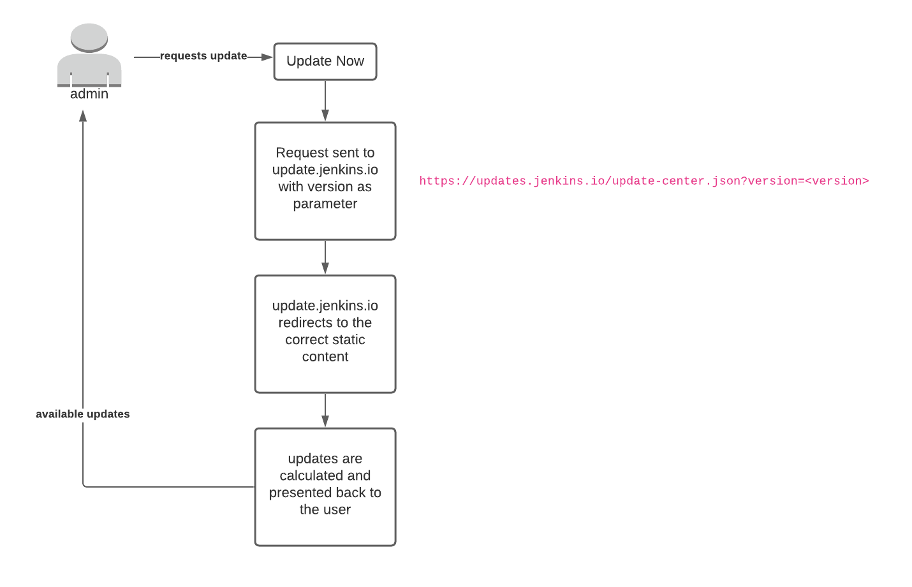
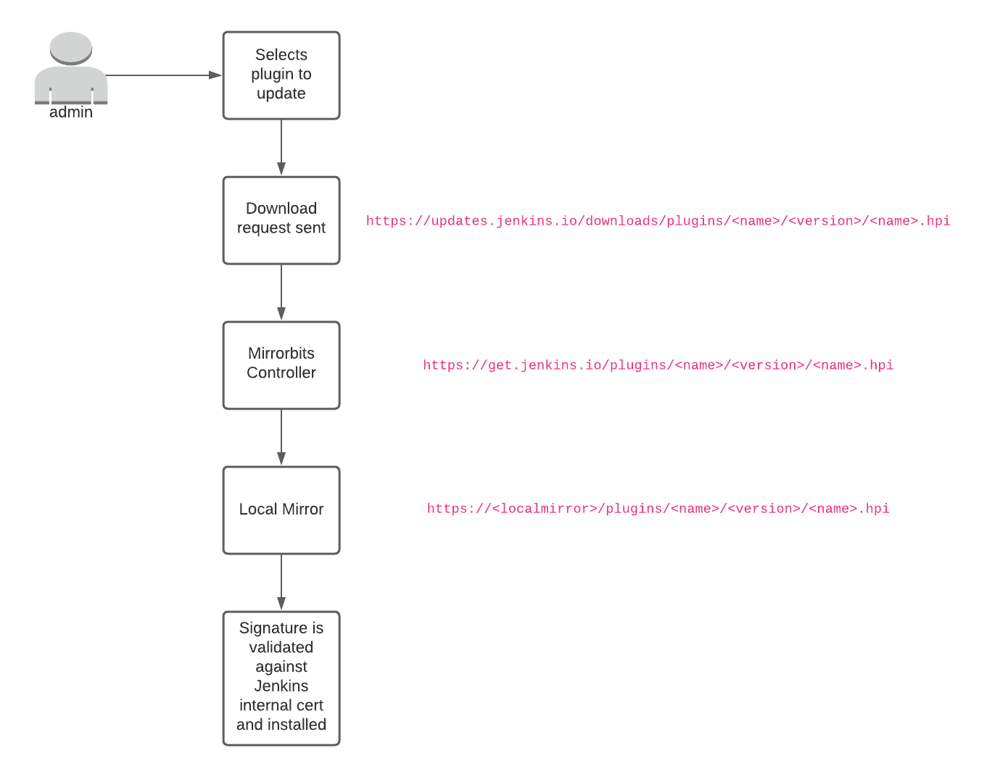

# OSS Update Center Site Architecture
This script generate the code and data behind https://updates.jenkins-ci.org/

The service this website provides is as follows:

 1. Jenkins will hit well-known URLs hard-coded into Jenkins binaries with
    the Jenkins version number attached as a query string, like
    https://updates.jenkins.io/update-center.json?version=1.345

 1. We use the version number to redirect the traffic to the right update site,
    among all the ones that we generate.

### What happens when 'Update Now' is pressed?

### What happens when a plugin is updated?

## Multiple update sites for different version ranges

### Dynamic update site tiers

Update center metadata can contain only one version per a plugin.
Because newer versions of the same plugin may depend on newer version of Jenkins, if we just serve one update center for every Jenkins out there, older versions of Jenkins will see plugin versions that do not work with them, making it impossible to install the said plugin.
This is unfortunate because some younger versions of the plugin might have worked with that Jenkins core.
This creates a disincentive for plugin developers to move to the new base version, and slows down the pace in which it adopts new core features.

So we generate several update centers targeted for different version ranges.

To accommodate all recent Jenkins releases, we first inspect all plugin releases for their Jenkins core dependencies.
We then generate tiered update sites for all releases identified this way that are more recent than a cutoff (~3 months).
Directories containing these tiered update sites have the prefix `dynamic-`.

mod_rewrite rules in an `.htaccess` file are then used to redirect requests from Jenkins versions to the next lower update site.
It will serve the newest release of each plugin that is compatible with the specified Jenkins version.
See [generate-htaccess.sh](generate-htaccess.sh) for how these rules are generated.

### Static update site tiers

Before June 2020, update site tiers were fixed:
Update sites were generated for the five most recent LTS baselines, and each update site would offer plugins compatible with the latest release of each LTS line.

These update site tiers are *deprecated*: They are currently still being generated, but `.htaccess` no longer reference them.
See e.g. https://github.com/jenkinsci/docker/issues/954

## Generating update sites

[generate.sh](generate.sh) is run by [a CI job](https://trusted.ci.jenkins.io/job/update_center/)
and generates all the different sites as static files, and deploys the directory into Apache.

A part of this is [.htaccess](static/.htaccess) that uses `mod_rewrite` to
redirect inbound requests to the right version specific website.

## Layout

See [a separate doc](LAYOUT.md) for the layout of the generated update site.
